# Apply to a custom avatar

So you have a custom avatar and wish to use my face tracking on it, here's a guide on how to do so

## head swap
 You'll need to change the head from your custom model to the one that has the face tracking blendshapes and correct weights.
 here are some steps on how to do so

 ### Locate your custom model's main FBX file and back it up

 First you'll need to find your main FBX file that contains the head of your model.
 To do so:
 - Select it in your scene hierarchy by left clicking on it:
 
- go to the inspector tab (By default on the left hand side)

- Click on the avatar armature component (the little green icon of a person)

- This will reveal the file in the unity file explorer

- Right Click on the parent file of the avatar armature component
- Export Package
- Untick ``Include dependencies`` in the window that opens
- press ``Export...``
- Select where you want your backup to be stored at
- Return back to Unity
- Right Click on the file again
- Click ``Show In Explorer``

 ### Open Blender

- Download Blender [here](https://www.blender.org/download/)
- Follow the install wizzard
- Open Blender

 ### Clear the scene
 - Click anywhere on the viewport to remove the startup splash screen
 - press ``A`` to select everything
 - press ``Del`` to delete everything

 ### Import your custom model

 - Direct yourself at the top left of your window
 - Click ``File``
 - Click ``Import``
 - Click ``FBX``

 

 - Select where your custom model is located at

 

 - Press the ``Import FBX`` button at the bottom left of the window

 Your custom model should now be into Blender!
 Feel free to save it somewhere safe by pressing ``Ctrl``+``S`` to save your progress :)

### Import the face tracking model

Same steps as before

 - Direct yourself at the top left of your window
 - Click ``File``
 - Click ``Import``
 - Click ``FBX``

 - Select where the face tracking model is located at (Under Hash's_Things/AvatarName/fbx)

 - Press the ``Import FBX`` button at the bottom left of the window

 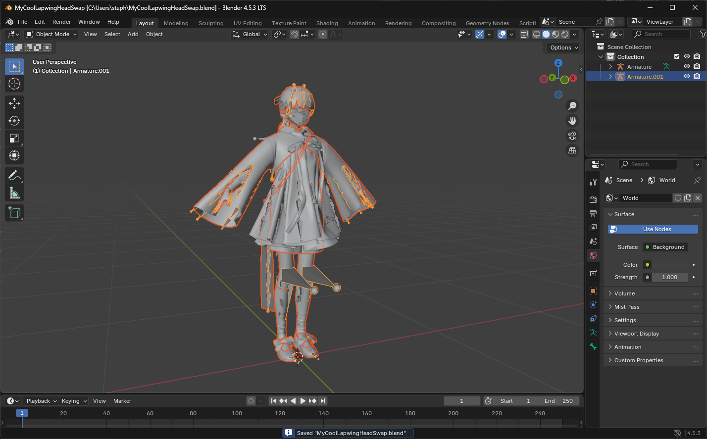

### Matching materials

- Develop what's under the armature that should be named ``Armature.001`` and select the face tracking head mesh (named ``Body.001`` most times)

- Select the Materials tab 

- Click the black materials icon to change the curently selected material

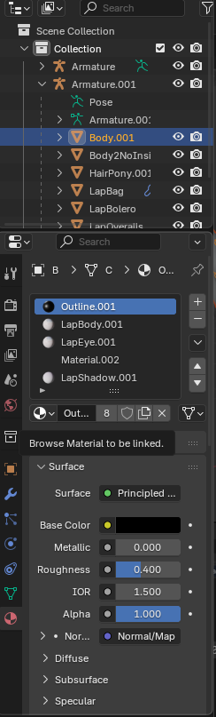

- Select the version of the material without the ``.001`` at the end of its name

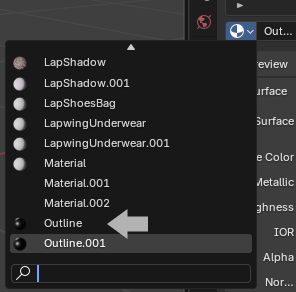

- Select the material bellow 

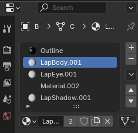

- Reproduce the process for the rest of the materials

### Assign the armature of the custom avatar to the face tracking head

- Develop what's under the armature that should be named ``Armature.001`` and select the face tracking head mesh (named ``Body.001`` most times)

- Select the modifiers tab 

- Click the Object field

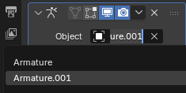

- Select ``Armature``

### Reparent head

- Select the Face tracking head mesh

- Drag it above the original armature

- Before releasing hold ``Shift``+``Alt``

- Release your left click

### Delete the rest of the face tracking fbx

- Select ``Armature.001``

- Hold ``Shift``

- Hold ``↓`` until everything is selected

- Press ``Del``

### Export your work

 - Direct yourself at the top left of your window
 - Click ``File``
 - Click ``Export``
 - Click ``FBX``

 

 - Select where your custom model is located at

 - Click the file

 - Switch back to Unity

 - Select your custom FBX file in the Unity file explorer 

 - Look at the inspector window

 - Take note of the Convert Units scaling (Here it's ``1M/Unit`` but it can also be ``1cm/Unit``)

 

 - In the Blender Export window take the appropriate export scaling ``1M/Unit = FBX All`` & ``1cm/Unit = All Local``

 - Press ``Export FBX``

### Match eye rotation from the face tracking fbx

 - Select the face tracking fbx in unity
 - Go to the inspector tab
 - Click on ``Rig``
 - Click ``Configure...``
 - Click on ``Muscles & Settings``
 - Under the ``Per-Muscle Settings`` group click on ``Head`` and develop the following: ``Eye Down-Up``, ``Eye In-Out``, ``Eye Down-Up``, ``Eye In-Out``
 - Take a screenshot to remember the settings

 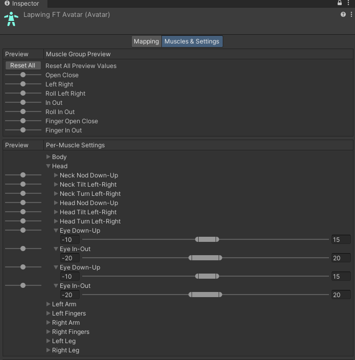

 - Press ``Done``

 - Repete the same To acces the eye muscle settings on your custom fbx

 - Enter the settings you screenshoted earlier

## Assign menu, parameters and animation controllers

- Drag and drop the face tracking prefab in your scene

- Right click on it

- Click properties

- Put the second inspector window side by side with the original one

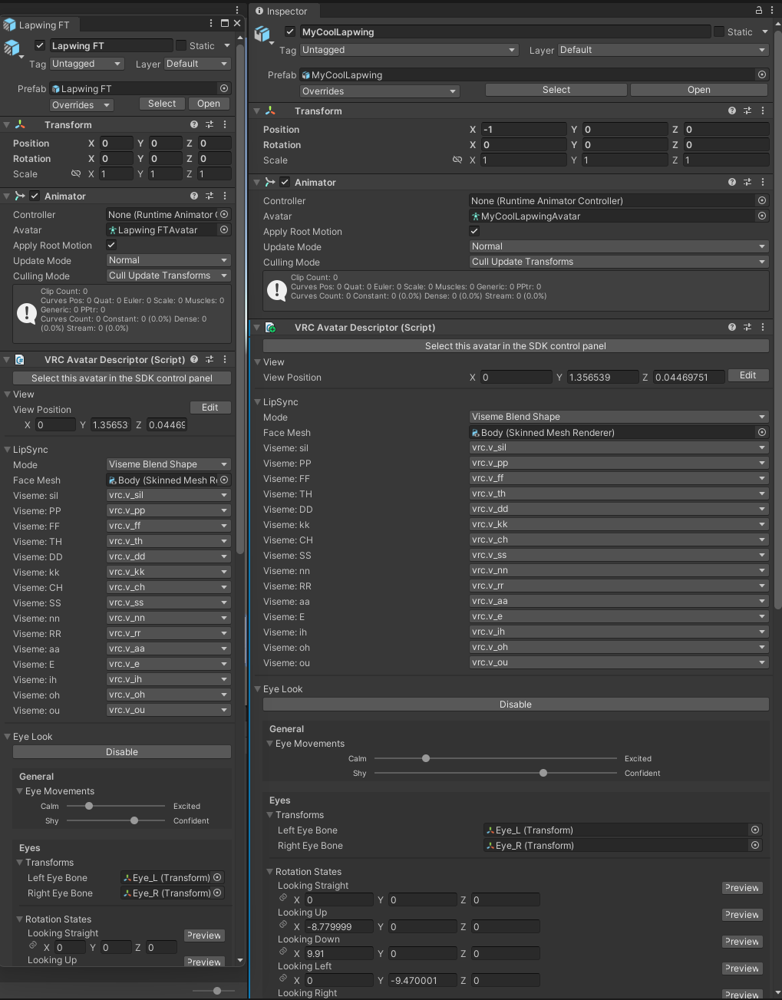

- Select your prefab

- Click on Playable Layers on both inspectors

- Click on the Additive animation controller on the FT prefab inspector

- Drag and drop the highlighted animation controller into the additive slot on your prefab

- Do the same for the FX controller

- Scroll down on both inspectors to the very bottom and click on expressions

- Remplace the menus in the same way

## Merging onto existing setups extra logic

This section is intresting if you have existing animation controller logic which enables custom toggles or systems on your avatar.

 Modular Avatar is not supported because it does not re-order the ID of VRC layer drivers which breaks my smoothing logic

 ### VRCFury
 Please note that I will not provide support for this way of merging my animation controllers

 >⚠️ Double check that your animator follows the following:
 >- Doesn't have any states that sets the ``Eyes & Eyelids`` section of a [Animator Tracking Control](https://creators.vrchat.com/avatars/state-behaviors/#animator-tracking-control) animation state behevior to anything other than ``No Change``
 >- Uses the ``FacialExpressionsDisabled`` to supress any gestures (All normal gesture transitions should have a check on ``FacialExpressionsDisabled`` == ``false`` and have a default state with only a single any state condition: ``FacialExpressionsDisabled`` == ``true``)

 - Add VRCFury to your list of reppositories by clicking [here](vcc://vpm/addRepo?url=https%3A%2F%2Fvcc.vrcfury.com)
 - Click ``Manage Project``
 - Search for VRCFury
 - Click the ``+`` Button
 
 - Go back to Unity
 - Right click on your avatar
 - Click on Create Empty
 - Name it something that makes sense (ex: ``VRCFHashFT``)
 - Click the ``Add Component`` Button
 - Search for ``Full Controller``

    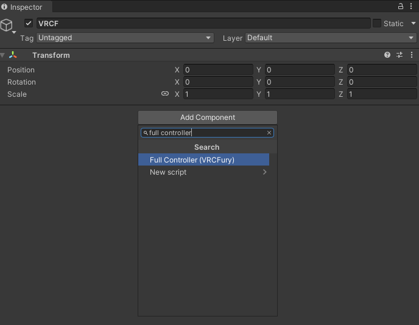

 - Click on the text ``Full Controller (VRCFury)`` to add the component

 - Click the ``+`` Button under the Controller section 2 times
 - Assign the ``FTOnly`` and ``Additive ET`` controllers that can be found under ``Hash's_Things/AvatarName/anim/controllers``

 - Click the ``+`` Button under the Menu section 
 - Assing the SimpleFTControls menu under File
 - Write ``FT`` under Prefix
 - Click the ``+`` Button under the parameters section
 - Assign the FTOnly parameters
 - Click on advanced options
 - Click the ``+`` Button under global parameters
 - Write ``*``

 - Optional
    - Add an ``Override Menu Icon`` component
    - Write ``FT`` on the Menu Path
    - Click the target next to the icon slot
    - Search for ``FaceTrackingIcon2``

 - This is what it should look like:

 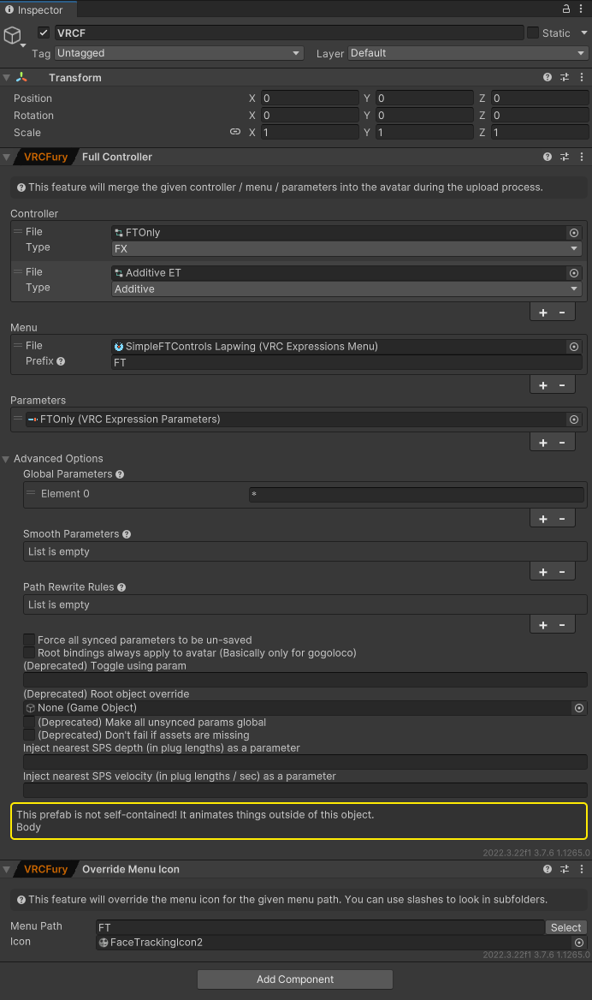
 

### Manual
- Make sure you have ``Avatars 3.0 Manager`` added to your project's packages

    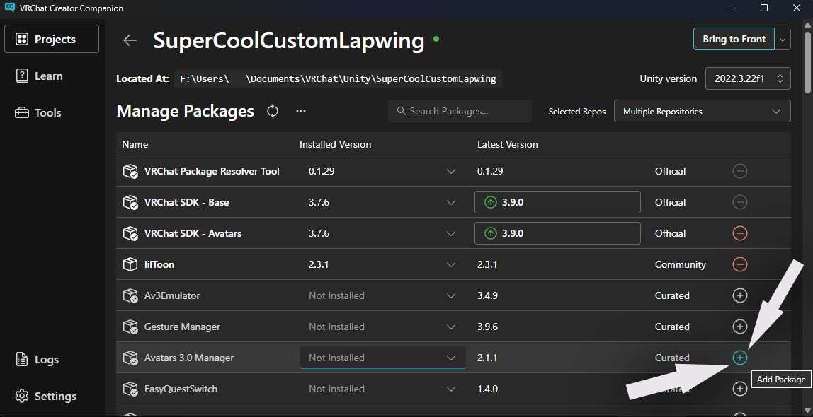

#### FX
- Open your animator by selecting your avatar scrolling to ``playable layers`` and double on the item next to ``FX``

    

- Duplicate it by selecting it and pressing ``Ctrl``+``D``

- Identify and delete anything that's not part of the default ``FX`` controller
    - To do that you'll need to compare what you added on top of your FX controller by oppening your animation controller and the default one

        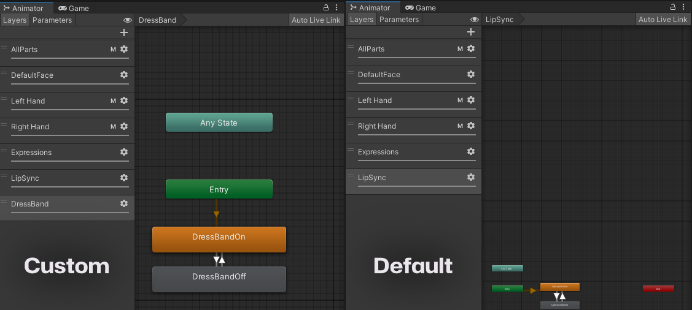
        > Here for exemple only the ``DressBand`` layer has been added

        
        > This is what mine looks like after deleting the rest of the layers

 - ⚠️ Make sure that you don't have any states that sets the ``Eyes & Eyelids`` section of a [Animator Tracking Control](https://creators.vrchat.com/avatars/state-behaviors/#animator-tracking-control) animation state behevior to anything other than ``No Change``

- Assign the Face Tracking animator that corresponds to the name of your FX Controller with FT at the end of it

- Open The AV3 Emulator window

    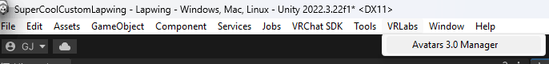

- Drag and drop your avatar in the avatar slot

- Click FX

- Scroll down to the bottom

    

- Click ``Add Controller to merge``

- Drag and drop the duplicate of your FX Controller with only your animation logic

- Click ``Clear All Sufixes``

    

- Click ``Merge on copy``

- You're done with the animator!

#### Parameters

- Switch your parameters to the ones that corresponds to the name of your parameters with FT at the end of it
- Extract your custom logic VRCAvatarParameters onto a different file
- Open the Avatar 3.0 Manager window
- Drag and drop your avatar
- Click on the parameters tab

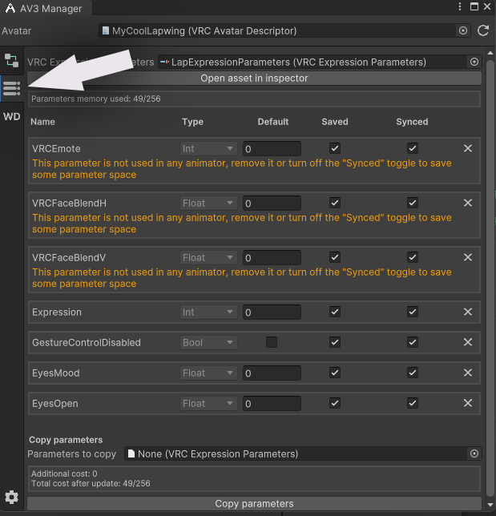

- Add your isolated parameters
- Click ``Copy parameters``

#### Menus

- Select your exisiting menu by double clicking the item next to menu under the expression dropdown of the avatar descriptor
- Click the ``+`` button

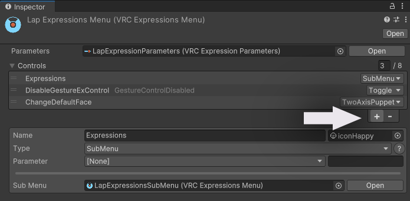

- Rename the menu to ``FT``

- Click the little target near the icon and search for ``Face`` and assign the white VRCFT logo

- Select ``SubMenu`` as the type

- Click the little target next to sub menu and search for ``simple`` and assign the simple sub menu

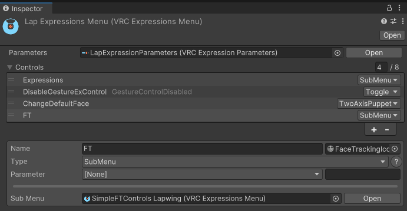