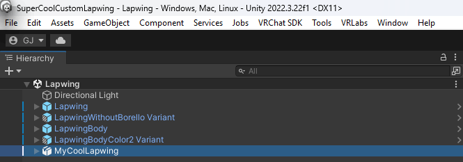
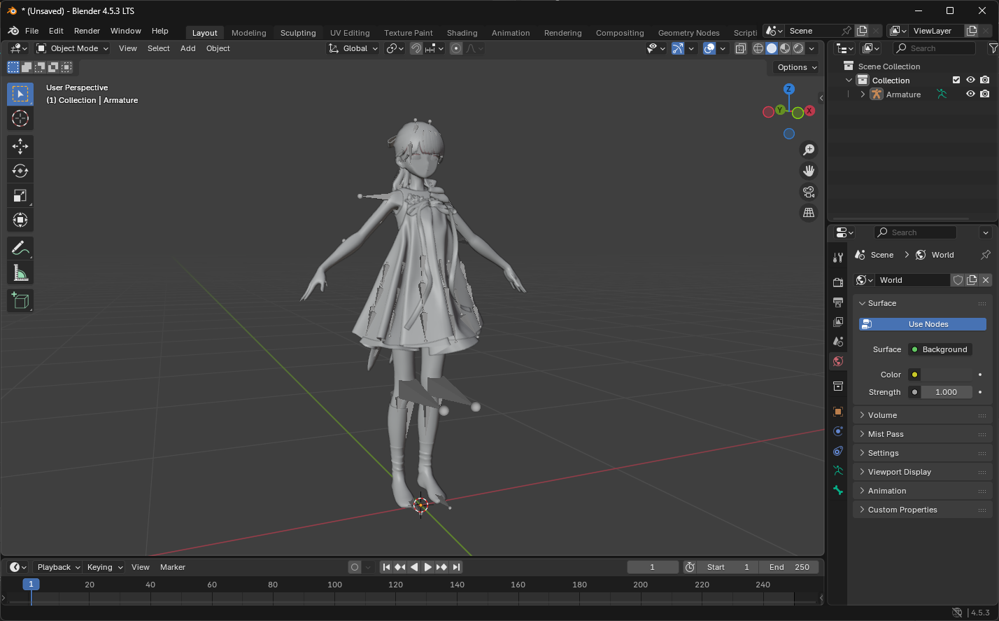
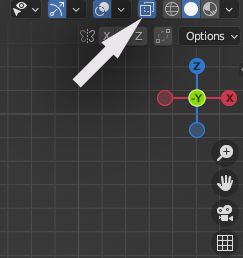
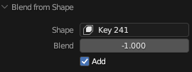
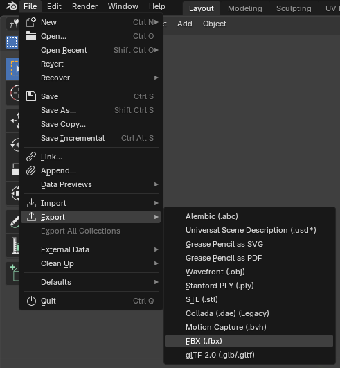
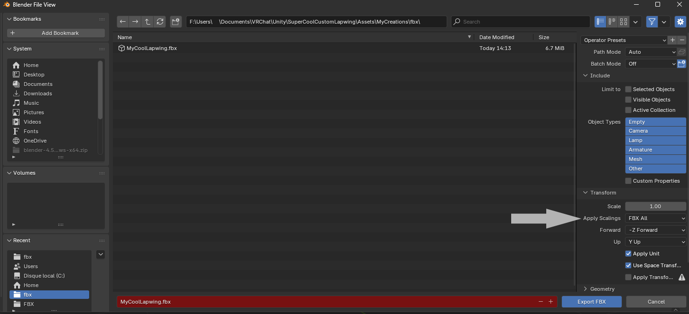

# Commun issues

## The avatar version listed on the store page is no longer avaliable

If the specific avatar package version is not avaliable anymore please contact me trough Booth DMs [here](https://hashedits.booth.pm/conversations).

I will try my best to provide an update to retain compatibility as fast as possible

## I've adjusted my avatar with blendshapes and clipping occurs when blinking

This guide is useful if you've adjusted your model with blendshapes

 ### Locate your custom model's main FBX file and back it up

 First you'll need to find your main FBX file that contains the head of your model.
 To do so:
 - Select it in your scene hierarchy by left clicking on it:
 
- go to the inspector tab (By default on the left hand side)

- Click on the avatar armature component (the little green icon of a person)

- This will reveal the file in the unity file explorer

- Right Click on the parent file of the avatar armature component
- Export Package
- Untick ``Include dependencies`` in the window that opens
- press ``Export...``
- Select where you want your backup to be stored at
- Return back to Unity
- Right Click on the file again
- Click ``Show In Explorer``

 ### Open Blender

- Download Blender [here](https://www.blender.org/download/)
- Follow the install wizzard
- Open Blender

 ### Clear the scene
 - Click anywhere on the viewport to remove the startup splash screen
 - press ``A`` to select everything
 - press ``Del`` to delete everything

 ### Import your custom model

 - Direct yourself at the top left of your window
 - Click ``File``
 - Click ``Import``
 - Click ``FBX``

    

 - Select where your custom model is located at

    

 - Press the ``Import FBX`` button at the bottom left of the window

 Your custom model should now be into Blender!
 Feel free to save it somewhere safe by pressing ``Ctrl``+``S`` to save your progress 

### Generate a mix of your blendshapes

 Back in unity take note of your blendshape mix and reproduce it in blender

- I suggest using [nekobako](https://x.com/nekobako)'s Editor Patcher, [here's](vcc://vpm/addRepo?url=https%3A%2F%2Fvpm.nekobako.net/index.json) a link that will add it to your VCC 

- Click ``Manage Project`` on your project

- Search ``Editor Patcher`` and click the `+` icon to it to your repositories

- Select your face mesh on your avatar (It's called ``Body`` Here)

- Develop the ``Blendshapes`` section

- Press the little ``0`` next to the search bar to only show the blendshapes that are non zero

- Select your face mesh in Blender by simply clicking on it in the viewport

- To select the value in blender go to the data properties tab (3 green dots linked together) 

 - Develop the ShapeKeys menu
 - Click the search arrow right above the ``Relative`` checkbox

    

 - Search for the same blendshapes you have customised on Unity (in my case here it's ``browDownAngryRight`` & ``browDownAngryLeft``)

 - Set them to the same values (be careful blender shapekeys are 0→1 where unity is 0→100)

    

 - Click the little down arrow bellow the ``-`` button

 - Click ``New Shape from mix``

    

 - Press the little ``X`` near the search bar and scroll at the bottom of the list to reset your search

 - Press the Little X On the same line as the ``Relative`` tickbox
 
 - Scroll down at the Copy the name of your shapekey mix (you can double click the name to select the text) (in my case it's ``Key 241``)

    

### Applying the fix

 - Search ``EyeClosed`` in the shapekey list the same way you searched your custom shapekeys

 - Click the Y- Gizmo or press Numpad1 to make the avatar face forward

    

 - Go into edit mode by pressing ``Tab`` while having your mouse over the viewpoint

 - Click the Xray Mode button at the top right corner of your viewpoint

    

- Select Roughly the right side of your face

- Select the ``EyeClosedRight`` ShapeKey

- Press ``Ctrl`` + ``V`` above your viewport

- Select ``Blend from Shape``

    

- Click the little arrow to develop the Blend from Shape menu

    

- Paste the name of your custom mix (``Key 241`` for me)

- Make sure ``Add`` is ticked

- Set a weight of ``-1``

    
    >This is what it should look like

- Click in anywhere on your viewpoint to clear your selection

- Roughly select the Left side of your face

    

- Reproduce the process with selecting ``EyeClosedLeft``

### Export your work

 - Direct yourself at the top left of your window
 - Click ``File``
 - Click ``Export``
 - Click ``FBX``

 

 - Select where your custom model is located at

 - Click the file

 - Switch back to Unity

 - Select your custom FBX file in the Unity file explorer 

 - Look at the inspector window

 - Take note of the Convert Units scaling (Here it's ``1M/Unit`` but it can also be ``1cm/Unit``)

 

 - In the Blender Export window take the appropriate export scaling ``1M/Unit = FBX All`` & ``1cm/Unit = All Local``

 - Press ``Export FBX``

 You're done!

## Eye rotation broken

This is likely caused in situations where the avatar component doesn't reference the right eye bones, this can be caused by a few different factors:

Your eye bones are not mapped

 - To idetify the issue: Select your avatar's fbx file in unity, go to the rig tab, configure, then select head, and look if your eye bones are properly assigned

 - To fix: If they are not assigned, select them from the hierarchy on the left

The reference to the eye bones is missing

 - To idetify the issue: likely caused by swaping the head mesh

 - To fix: Perform a head swap in blender, here's [a step by step guide on how to do it](../Customisation/ApplyToCustomAvatar.md#head-swap)

Another animation is preventing the eye from moving

 - To idetify the issue: Use the same animation controllers as the prefabs I provide and remove any moudlar avatar or VRCFury components

 - To fix: Check for [Animation Tracking Control](https://creators.vrchat.com/avatars/state-behaviors/#animator-tracking-control) components that may set the ``Eyes & Eyelids`` the ``Tracking`` state, and/or add-in one by one every modular avatar or vrcfury component to identify which one is causing the issue.

## Patcher script creates red errors

This is a commun issue on some computers with their language set to something different than English.

This can be solved by:
- Opening your windows control pannel
- Clock and Region
- Region
- Aelect ``Administration`` at the top of the window
- Click ``Modify global settings`` under ``Language for non unicode programs``
- Select ``English (United States)``

>You can revert the changes after patching the model

## My custom blendshapes configuration gets reset when I upload my avatar

This is likely because the avatar has a resting face animation which resets some or all of your custom blendshapes configuration,

This can be fixed by recording your custom configuration on top of that resting animation