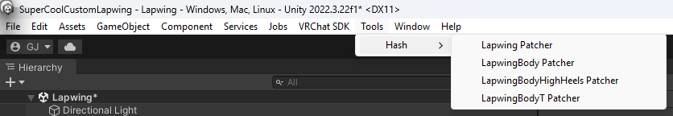

# Configuration

Cette section de la documentation explique comment installer l'un des module complémentaire de Face Tracking de Hash sans aucune connaissance préalable de la création d'avatars VRChat.

## Télécharger le module complémentaire depuis Booth/Ko-fi

Cliquez sur le bouton de téléchargement et décompressez l'archive si vous avez acheté le module complémentaire sur Booth.

## Téléchargez la version appropriée de l'avatar.

Consultez la fiche produit du module complémentaire dans la boutique. Vous y trouverez une version de l'avatar compatible avec le module complémentaire.

Téléchargez-la également sur Booth.

Si la version spécifique du pack avatar n'est plus disponible, veuillez me contacter via les messages privés de Booth [ici](https://hashedits.booth.pm/conversations).

## Ouvrez Unity

Ouvrez votre [VRChat Creator Companion](https://vcc.docs.vrchat.com/) et créez ou ouvrez un projet.

(lorsque vous créez un projet, veuillez utiliser le projet par défaut de VRChat `Unity 2022 Avatar Project` et lui donner un nom pertinent)

## Importer l'avatar

Faites glisser et déposez le fichier .UnityPackage de l'avatar vers la fenêtre de l'éditeur Unity de votre projet.

Cliquez sur « Importer » dans la fenêtre qui s'affiche.

## Importer mon module complémentaire

Faites glisser et déposez le fichier .UnityPackage de mon module complémentaire vers la fenêtre de l'éditeur Unity de votre projet.

Cliquez sur « Importer » dans la fenêtre qui s'affiche.

## Générer le modèle de suivi du visage

- Allez en haut de votre fenêtre Unity et cliquez sur `Tools`->`Hash`->`AvatarName`

> Certains auront plusieurs options pour différents prefab, vous êtes libre de choisir celle que vous voulez ou de toutes les sélectionner

- Cliquez sur le bouton `Patch` dans la fenêtre qui s'ouvre.

## Placez le prefab dans votre scène.

- Ouvrez le dossier `Assets`/`Hash's_Things`/`AvatarName`/`prefab`.

- Glissez-déposez le prefab que vous souhaitez utiliser dans votre scène.

## Télécharger vers VRChat

- Ouvrez la fenêtre VRChatSDK en cliquant sur `VRCSDK`->`Show Control Panel` en haut de votre fenêtre Unity.
- Connectez-vous à votre compte VRChat.
- Allez dans l'onglet « Builder ».
- Donnez un nom à votre avatar
- Capturez une image d'aperçu pour votre avatar
- Acceptez les conditions en bas de la fenêtre
- Cliquez sur le gros bouton `Build & Publish`

## Lancez VRCFT

- VRCFT est disponible sur [Steam](https://store.steampowered.com/app/3329480/VRCFaceTracking/)

- Téléchargez le module pour votre dispositif de Face Tracking dans le registre des modules

> Si vous avez besoin de plus d'informations, [voici la documentation](https://docs.vrcft.io/docs/intro/getting-started) sur la façon de le configurer

## Lancez VRChat 

VRChat est disponible sur [Steam](https://store.steampowered.com/app/438100/VRChat/)

## Passez à votre avatar

- Ouvrez l'onglet Avatars
- Allez dans l'onglet Téléchargés
- Cliquez sur votre avatar
- Cochez la case sous l'aperçu 3D pour passer à l'avatar

## Profitez

## Vous souhaitez plus d'informations ?

Vous pouvez consulter cette documentation pour en savoir plus sur la manière d'[appliquer l'extension à votre avatar personnalisé](/fr/customisation/apply-to-custom-avatar.md) ou de [résoudre les problèmes courants](/fr/common-issues/).