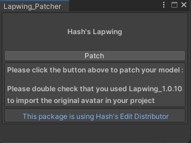

# Upgrade face tracking version

Every so often I will revisit some of my face tracking add-ons to keep them up to date with my newer findings, here's a guide on how to update:

## Create prefabs of your avatar(s)

Drag and drop your avatar(s) in your unity file explorer and click `Create Original Prefab` if a dialog box opens

## Delete the fbx

delete the folder `Hash's_Things/AvatarName/fbx`

## Patch the model like you did the first time

- Go at the top of your Unity window and click on `Tools`->`Hash`->`AvatarName`

> Some will have multiple options for different prefabs, you're free to do the one you want or all of them

- Click the `Patch` button on the window that opens

## Make sure you are using the same animation controllers as the base FT prefab

- Navigate to `Hash's_Things/AvatarName/prefabs`
- Right Click → Properties
- Scroll down and look at the animation controllers
- Select your avatar
- Make sure that the animation controllers and parameters are matching

## You're done!
